# Documentación Completa — Middleware Designer

Documento generado automáticamente con análisis del repositorio. Contiene README principal, tabla resumen, docstrings sugeridos y diagrama del proyecto.

---

## 1. README principal del proyecto

> Este contenido puede usarse como `README.md` en la raíz del repositorio.

---

# Middleware Designer

Ecosistema para **diseñar interfaces dinámicas** a partir de los contratos **OpenAPI** de microservicios. Permite registrar backends, inspeccionar contratos, configurar endpoints y DTOs, y generar formularios y grillas desde metadatos.

## Estado del proyecto

| Capa | Tecnología | Puerto |
|------|------------|--------|
| ✅ Operativo | **Backend** · Python (FastAPI) + SQLAlchemy 2.0 | 8000-8009 |
| ✅ Operativo | **Middleware** · Orquestador OpenAPI | 9000 |
| ✅ Operativo | **Frontend** · Angular 17+ (metadatos) | 4200 |

### C4 — Contexto del sistema (Nivel 1)

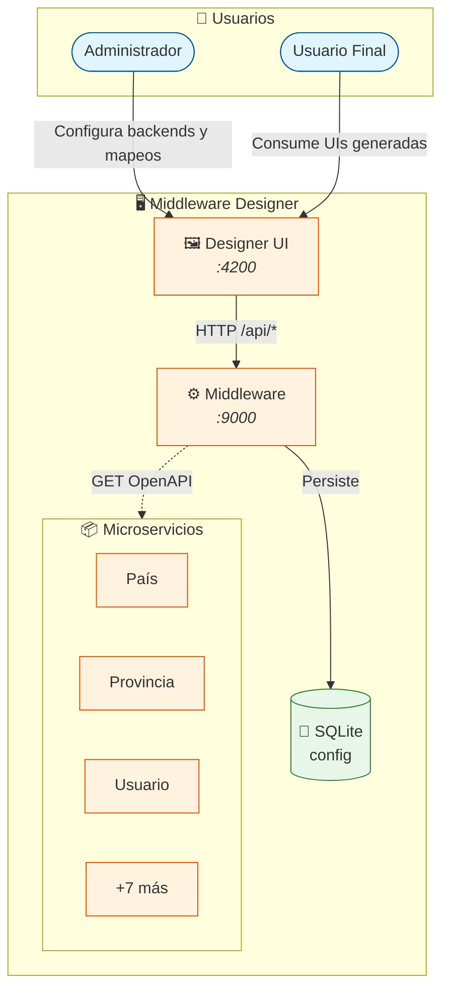

## Estructura del monorepo (C4 — Nivel Contenedor)

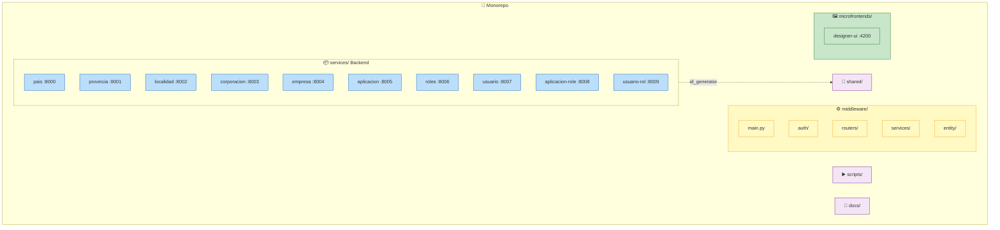

## Dependencias principales

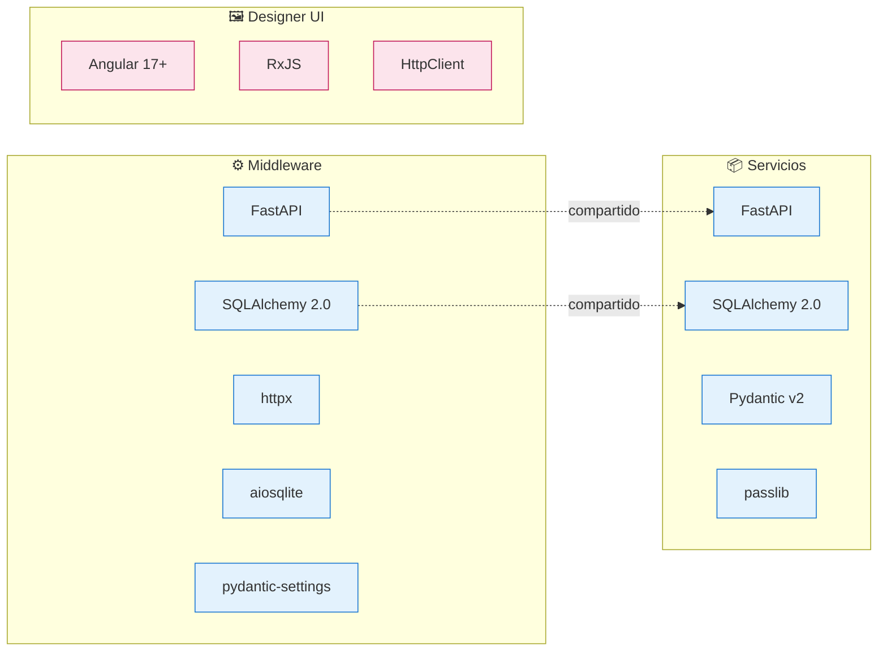

## Ejecución

### Requisitos

| Requisito | Versión |
|-----------|---------|
| Python | 3.8+ |
| Node.js y npm | — |
| Angular CLI | (para microfrontends) |

### Inicio rápido

**Windows (PowerShell):**
```powershell
.\scripts\start_all.ps1
```

**Linux / macOS:**
```bash
chmod +x scripts/*.sh
./scripts/start_all.sh
```

### Inicio por componentes

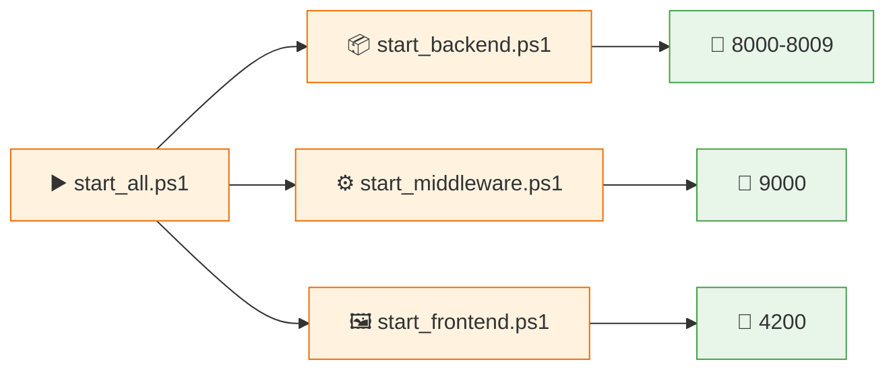

| Componente | Script | Puerto |
|------------|--------|--------|
| Backend | `start_backend.ps1` | 8000-8009 |
| Middleware | `start_middleware.ps1` | 9000 |
| Designer UI | `start_frontend.ps1` | 4200 |

### Seeds iniciales

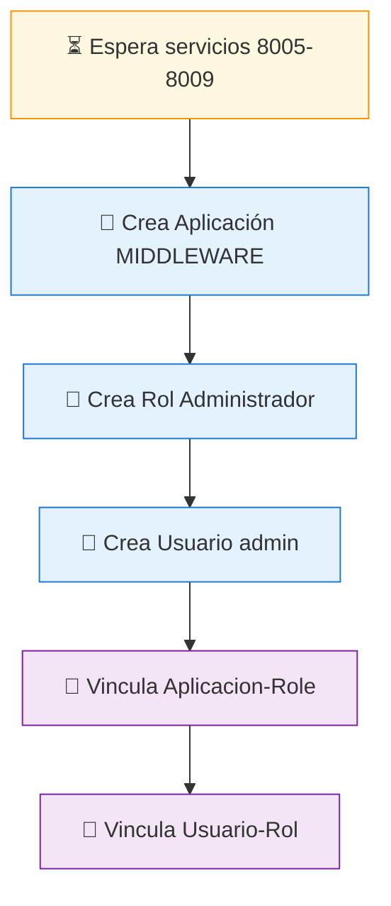

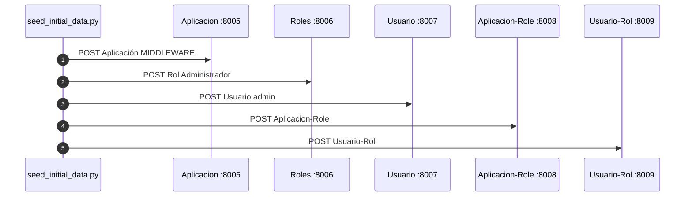

> **Nota:** El script de seeds se ejecuta automáticamente tras `start_all.ps1`.

## API principal (C4 — Nivel Componente)

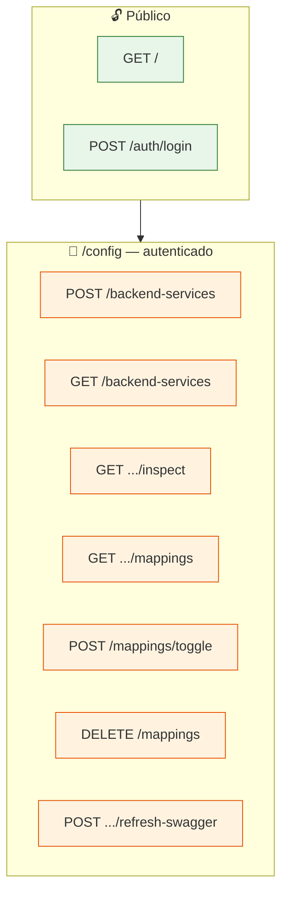

| Método | Ruta | Descripción |
|--------|------|-------------|
| GET | `/` | Health/welcome |
| POST | `/auth/login` | Login (usuario/contraseña) |
| POST | `/config/backend-services` | Registrar backend (URL OpenAPI) |
| GET | `/config/backend-services` | Listar backends |
| GET | `/config/backend-services/{id}/inspect` | Inspección de endpoints y DTOs |
| GET | `/config/backend-services/{id}/mappings` | Mapeos del servicio |
| POST | `/config/mappings/toggle` | Habilitar/actualizar mapeo |
| DELETE | `/config/mappings` | Deshabilitar mapeo |
| POST | `/config/backend-services/{id}/refresh-swagger` | Refrescar contrato |

> **Seguridad:** Las rutas bajo `/config` requieren autenticación (Basic Auth o Database Auth).

## Pantallas del Designer UI

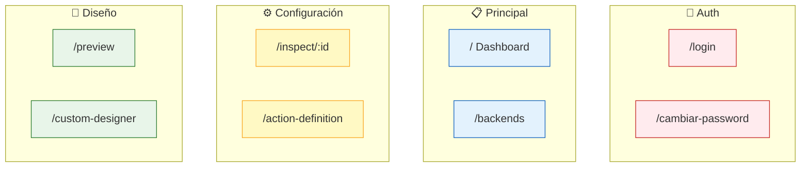

| Ruta | Descripción |
|------|-------------|
| `/login` | Inicio de sesión |
| `/` | Dashboard (heartbeat, estado de servicios) |
| `/backends` | Gestión de microservicios |
| `/inspect/:id` | Inspección de contrato por servicio |
| `/inspect/:id/action-definition` | Definición de acción (labels, orden, visibilidad) |
| `/preview` | Prueba de endpoints en tiempo real |
| `/custom-designer` | Diseño de menú/estructura |
| `/cambiar-password` | Cambio de contraseña en primer login |

## Documentación adicional

| Documento | Descripción |
|-----------|-------------|
| [docs/README.md](README.md) | Índice de documentación |
| [docs/PRD.md](PRD.md) | Requisitos de producto |
| [docs/auth.md](auth.md) | Autenticación en el middleware |
| [documentacion/](../documentacion/) | PRD extendido, arquitectura, catálogo de servicios |

---

## 2. Tabla resumen de archivos

| Archivo | Propósito | Nivel doc. previo | Acciones sugeridas |
|---------|-----------|-------------------|-------------------|
| `middleware/main.py` | Entrada del middleware, lifespan, CORS, OpenAPI custom | Medio | Añadir docstring de módulo |
| `middleware/routers/config_routes.py` | CRUD backends, mappings, inspección, refresh swagger | Bajo | Docstrings para `_service_to_dto` y endpoints |
| `middleware/routers/auth_routes.py` | Login, validación de credenciales | Medio | Mantener |
| `middleware/services/openapi_service.py` | Fetch OpenAPI, extract_endpoints, resolución DTOs | Alto | Mantener |
| `middleware/auth/dependencies.py` | get_current_user, _get_provider | Medio | Mantener |
| `middleware/auth/basic_auth.py` | BasicAuthProvider | Medio | Mantener |
| `middleware/auth/database_auth.py` | DatabaseAuthProvider (contra servicio Usuario) | Medio | Mantener |
| `middleware/auth/auth_config.py` | AuthSettings, variables de entorno | Alto | Mantener |
| `middleware/auth/auth_provider.py` | Protocolo AuthProvider, UserInfo | Alto | Mantener |
| `middleware/entity/config_models.py` | BackendService, FrontendService, BackendMapping | Medio | Docstrings de clase |
| `middleware/config/database.py` | Engine SQLite async, AsyncSessionLocal | Bajo | Docstring de módulo |
| `shared/id_generator.py` | generate_entity_id, is_valid_entity_id | Alto | Mantener |
| `services/usuario/main.py` | Entrada servicio Usuario | Bajo | Docstring de módulo |
| `services/usuario/services/usuario_service.py` | CRUD usuarios, validate_credentials, cambiar_password | Medio | Docstrings Google style |
| `services/usuario/routers/usuario_routes.py` | Rutas REST usuarios | Bajo | Docstrings en endpoints |
| `services/usuario/routers/auth_routes.py` | validate_login (auth/validate) | Medio | Mantener |
| `services/aplicacion/main.py` | Entrada servicio Aplicación | Bajo | Docstring de módulo |
| `services/aplicacion/services/aplicacion_service.py` | CRUD aplicaciones | Bajo | Docstrings |
| `services/roles/main.py` | Entrada servicio Roles | Bajo | Docstring de módulo |
| `services/corporacion/main.py` | Entrada servicio Corporación | Bajo | Docstring de módulo |
| `services/empresa/main.py` | Entrada servicio Empresa | Bajo | Docstring de módulo |
| `services/provincia/main.py` | Entrada servicio Provincia | Bajo | Docstring de módulo |
| `services/pais/main.py` | Entrada servicio País | Bajo | Docstring de módulo |
| `scripts/seed_initial_data.py` | Seeds: Aplicación, Rol, Usuario admin | Alto | Mantener |
| `microfrontends/designer-ui/.../middleware.service.ts` | Cliente HTTP al middleware | Medio | JSDoc para métodos |
| `microfrontends/designer-ui/.../auth.service.ts` | Gestión de sesión | Medio | JSDoc |
| `microfrontends/designer-ui/.../dashboard.component.ts` | Panel de control, heartbeat | Bajo | JSDoc de clase |

---

## 3. Docstrings sugeridos (Google style)

### Estructura Google Style

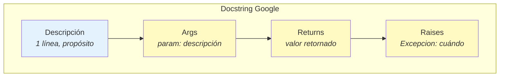

| Sección | ¿Cuándo? | Uso | Ejemplo |
|---------|-----------|-----|---------|
| **Descripción** | Siempre | Propósito en 1 línea | `Genera ID en formato TTTT_YYMMDDHHMMSSFFFF.` |
| **Args** | Si hay parámetros | Parámetros de entrada | `password: Contraseña en texto plano.` |
| **Returns** | Si retorna valor | Valor de retorno | `True si la contraseña coincide.` |
| **Raises** | Si lanza excepciones | Excepciones posibles | `ValueError: Si tipo no está en ENTITY_TYPES.` |

### Índice por archivo

| # | Archivo | Elemento | Tipo |
|---|---------|----------|------|
| 1 | `middleware/main.py` | módulo, lifespan | Módulo |
| 2 | `middleware/routers/config_routes.py` | _service_to_dto | Función |
| 3 | `middleware/config/database.py` | módulo | Módulo |
| 4 | `services/usuario/main.py` | módulo | Módulo |
| 5 | `services/usuario/services/usuario_service.py` | _hash_password, _verify_password, validate_credentials | Funciones |
| 6 | `services/aplicacion/main.py` | módulo | Módulo |
| 7 | `shared/id_generator.py` | generate_entity_id, is_valid_entity_id | Referencia (ya documentado) |

> **Consejo:** Añadir los docstrings de forma incremental. Empezar por módulos principales (`main.py`, `database.py`) y luego por funciones públicas expuestas en routers o servicios.

---

### Middleware

#### 1. `middleware/main.py`

> **Aplicar en:** encabezado del archivo y función `lifespan`

```python
"""
Punto de entrada del Middleware Designer.

Aplica lifespan para crear tablas de configuración al iniciar,
configura CORS para el Designer UI y expone esquema OpenAPI
con BasicAuth para rutas bajo /api/v1/config.
"""

@asynccontextmanager
async def lifespan(app: FastAPI):
    """
    Gestiona el ciclo de vida de la aplicación.

    Crea las tablas de configuración (BackendService, FrontendService, BackendMapping)
    si no existen y dispone el engine al cerrar.
    """
```

#### 2. `middleware/routers/config_routes.py`

> **Aplicar en:** función `_service_to_dto` (línea ~22)

```python
def _service_to_dto(svc: BackendService) -> BackendServiceResponse:
    """
    Convierte un modelo SQLAlchemy BackendService a DTO de respuesta.

    Args:
        svc: Instancia de BackendService.

    Returns:
        BackendServiceResponse con campos serializados, manejando valores
        opcionales (swagger_hash, swagger_last_updated, has_swagger_changes)
        de forma segura.
    """
```

#### 3. `middleware/config/database.py`

> **Aplicar en:** encabezado del archivo

```python
"""
Configuración de base de datos para el middleware.

Usa SQLite asíncrono (aiosqlite) como almacenamiento local
para BackendService, FrontendService y BackendMapping.
Ruta por defecto: ./middleware_config.db
"""
```

---

### Servicios

#### 4. `services/usuario/main.py`

> **Aplicar en:** encabezado del archivo

```python
"""
Servicio de gestión de usuarios.

Expone CRUD de usuarios y endpoints de autenticación:
- POST /api/v1/auth/validate (usado por middleware AUTH_TYPE=database)
- POST /api/v1/auth/cambiar-password

Ejecuta migraciones en lifespan:
- Esquema: password_hash, requiere_cambio_password.
- Usuarios con password null → "1234" y requiere_cambio_password=true (cambiar en primer login).
"""
```

#### 5. `services/usuario/services/usuario_service.py`

> **Aplicar en:** funciones `_hash_password`, `_verify_password` y `validate_credentials`

```python
def _hash_password(password: str) -> str:
    """
    Genera hash bcrypt de la contraseña.

    Args:
        password: Contraseña en texto plano.

    Returns:
        Hash bcrypt para almacenar en BD.
    """

def _verify_password(plain: str, hashed: str) -> bool:
    """
    Verifica contraseña contra hash bcrypt.

    Args:
        plain: Contraseña en texto plano.
        hashed: Hash almacenado.

    Returns:
        True si la contraseña coincide.
    """

async def validate_credentials(username: str, password: str) -> Optional[Tuple[str, str, bool]]:
    """
    Valida credenciales contra la BD.

    Args:
        username: Nombre de usuario.
        password: Contraseña en texto plano.

    Returns:
        Tupla (usuario_id, nombre_usuario, requires_password_change) si válido,
        None si credenciales incorrectas.
    """
```

#### 6. `services/aplicacion/main.py`

> **Aplicar en:** encabezado del archivo

```python
"""
Servicio de gestión de aplicaciones del ecosistema.

Expone CRUD bajo /api/v1/aplicaciones/.
Ejecuta migración add_tipo en lifespan si la BD no tiene la columna.
Puerto predeterminado: 8005.
"""
```

---

### Shared (referencia)

#### 7. `shared/id_generator.py`

> **Estado:** ya tiene docstrings correctos · **Acción:** mantener como está

```python
def generate_entity_id(tipo: str) -> str:
    """
    Genera ID en formato TTTT_YYMMDDHHMMSSFFFF.

    Args:
        tipo: Código de 4 letras (APLI, ROLE, USUA, etc.).

    Returns:
        ID de 21 caracteres.

    Raises:
        ValueError: Si tipo no está en ENTITY_TYPES.
    """

def is_valid_entity_id(value: str) -> bool:
    """
    Valida que un ID cumpla el formato TTTT_YYMMDDHHMMSSFFFF.

    Args:
        value: Cadena a validar.

    Returns:
        True si el formato es válido.
    """
```

---

## 4. Diagrama Mermaid del proyecto

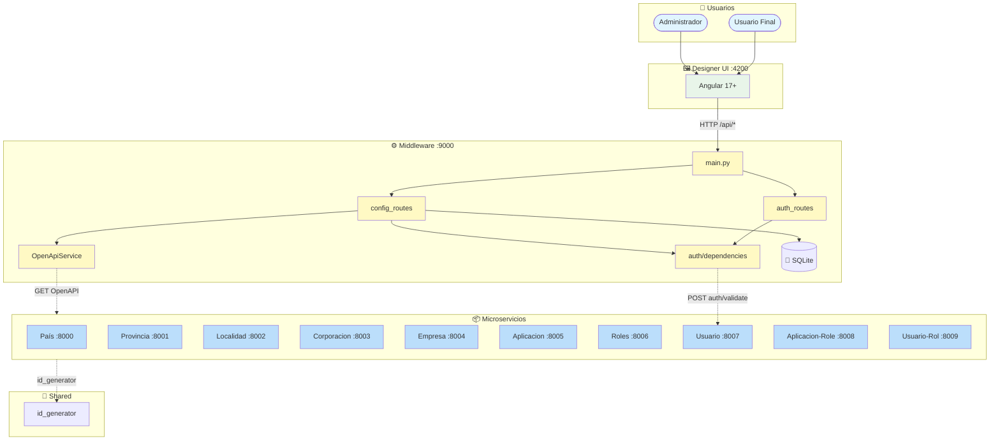

### Flujo de datos (secuencia)

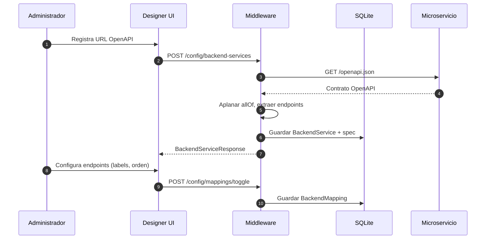

---

## 5. Tests y cobertura

| Área | Estado | Notas |
|------|--------|-------|
| Unitarios Python | No detectados | No hay archivos `test_*.py` ni `*_test.py` en el repositorio |
| E2E | No detectados | No hay pruebas E2E automatizadas |
| Cobertura estimada | 0% | Se recomienda añadir tests unitarios para servicios críticos (OpenApiService, id_generator, usuario_service) |

### Mejoras sugeridas
1. Añadir tests unitarios con `pytest` para `shared/id_generator.py`.
2. Tests de integración para `middleware/services/openapi_service.py`.
3. Tests para `services/usuario/services/usuario_service.py` (validate_credentials, cambiar_password).
4. Tests E2E con Playwright o Cypress para flujos clave del Designer UI.

---

## 6. Huecos de documentación y mejoras

| Hueco | Prioridad | Acción sugerida |
|-------|-----------|-----------------|
| Falta OpenAPI en `services/*/openapi/` | Media | Los servicios generan OpenAPI automático por FastAPI; documentar convención de rutas |
| DTOs sin docstrings en varios servicios | Baja | Añadir descripción en Pydantic Field() |
| Scripts de migración (migrate_add_*.py) | Media | Documentar en README del servicio Usuario/Aplicación |
| Variables de entorno del middleware | Alta | Ya documentado en docs/auth.md |
| Diagrama de arquitectura C4 | Media | Existe en documentacion/arquitectura/general.md |

---

## Referencias

- [docs/README.md](README.md)
- [docs/PRD.md](PRD.md)
- [docs/auth.md](auth.md)
- [documentacion/](../documentacion/)
- [scripts/README.md](../scripts/README.md)
