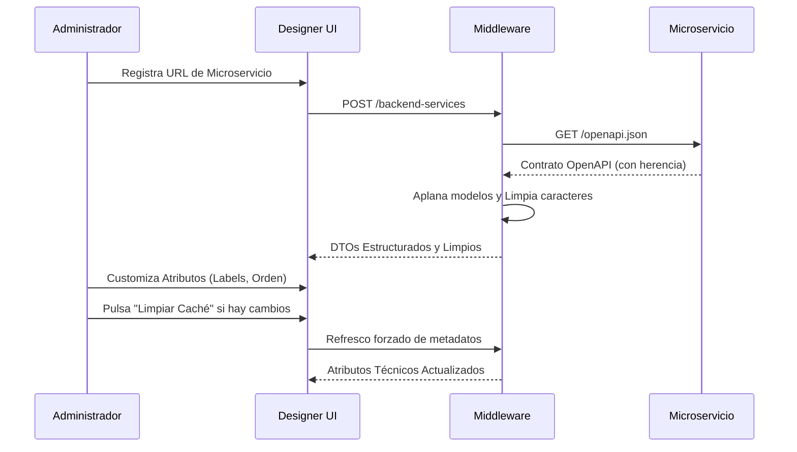

# Arquitectura del Monorepo - Middleware Designer

Este documento describe la arquitectura general del sistema, flujos de datos y componentes robustos de integración.

## 1. Visión General (C4 Model - Nivel 1)

```mermaid
graph TD
    User((Usuario Final))
    MFE[Microfrontend Designer UI]
    MW[Middleware Designer]
    DB_MW[(Middleware Config DB)]
    
    subgraph Microservicios Backend (FastAPI)
        SVC_P[Servicio País]
        SVC_PR[Servicio Provincia]
        SVC_L[Servicio Localidad]
        SVC_C[Servicio Corporación]
        SVC_E[Servicio Empresa]
    end

    User --> MFE
    MFE --> MW
    MW --> DB_MW
    MW -.->|Inspección Resiliente OpenAPI| SVC_P
    MW -.->|Inspección Resiliente OpenAPI| SVC_PR
    MW -.->|Inspección Resiliente OpenAPI| SVC_L
    MW -.->|Inspección Resiliente OpenAPI| SVC_C
    MW -.->|Inspección Resiliente OpenAPI| SVC_E
```

## 2. Componentes Críticos

### 2.1 Microservicios (Capa de Datos)
Cada microservicio es independiente y expone su propio contrato **OpenAPI**. 
- **Salud y Monitoreo**: Implementan CORS permisivo y endpoints de estado directo para permitir el monitoreo en tiempo real desde el Panel de Control.
- **Herencia de Modelos**: Utilizan Pydantic v2 con esquemas complejos (`allOf`, `anyOf`) para auditoría y validación.

### 2.2 Middleware (Capa de Orquestación Inteligente)
El corazón del sistema, diseñado para ser tolerante a fallos:
1. **Parser Resiliente**: Capaz de aplanar jerarquías de herencia (`allOf`) y resolver tipos opcionales (`anyOf`) de forma recursiva.
2. **Sanitización de Metadatos**: Limpia automáticamente caracteres no-ASCII y espacios en blanco de los contratos para asegurar la compatibilidad con el navegador.
3. **Caché Inteligente**: Almacena versiones locales pero permite el refresco forzado ante cambios estructurales en los servicios.

### 2.3 Microfrontend (Capa de Presentación Dinámica)
Aplicación Angular que genera interfaces basadas en metadatos:
- **Renderizado Robusto**: La UI inyecta valores por defecto si los metadatos del contrato son incompletos, evitando errores de visualización.
- **Diseñador de Acciones**: Permite personalizar etiquetas, orden y visibilidad de los atributos técnicos detectados.

## 3. Flujo de Configuración de UI


