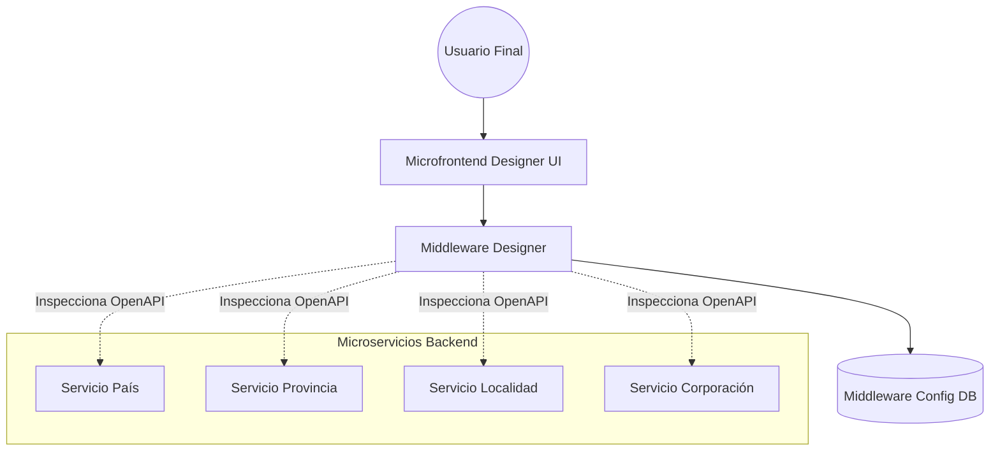
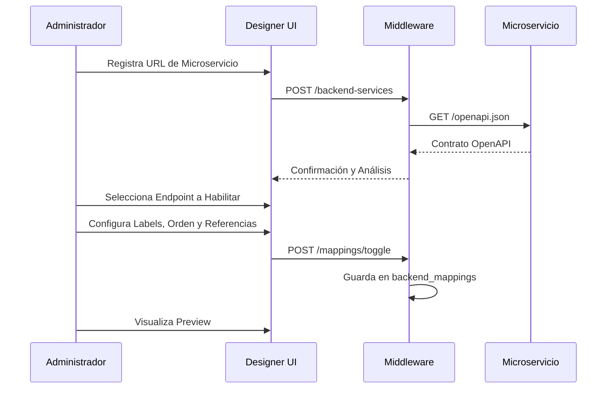

# Arquitectura del Monorepo - Middleware Designer

Este documento describe la arquitectura general del sistema, flujos de datos y componentes principales.

## 1. Visión General (C4 Model - Nivel 1)

## 2. Componentes

### 2.1 Microservicios (Capa de Datos)
Cada microservicio es independiente, desarrollado en **FastAPI** y expone su propio contrato **OpenAPI**.
- **País**: Gestión de países.
- **Provincia**: Gestión de provincias (depende de País).
- **Localidad**: Gestión de localidades (depende de Provincia y País).
- **Corporación**: Gestión de corporaciones.

### 2.2 Middleware (Capa de Orquestación)
Actúa como un puente inteligente. Sus funciones son:
1. **Registro**: Almacena las URLs de los microservicios activos.
2. **Inspección**: Lee y parsea los archivos `openapi.json` de los servicios.
3. **Mapeo**: Permite configurar qué atributos técnicos se muestran, su orden y labels visuales.
4. **Caché**: Almacena versiones locales de los contratos para evitar latencia.

### 2.3 Microfrontend (Capa de Presentación)
Desarrollado en **Angular**, proporciona la interfaz para que los administradores diseñen sus pantallas a partir de los contratos técnicos.

## 3. Flujo de Configuración de UI

