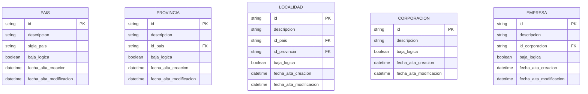

# Modelos de Datos y Entidad Relación

## 1. Base de Datos de Microservicios (Individuales)

Cada microservicio (`pais`, `provincia`, `localidad`, `corporacion`) utiliza una base de datos **SQLite** independiente con una estructura normalizada de auditoría y baja lógica.

### Estructura General de Entidades

## 2. Base de Datos del Middleware (`middleware_config.db`)

Centraliza la configuración del ecosistema.

### Detalle de `configuracion_ui` (JSON)
El campo `configuracion_ui` en `backend_mappings` es el más importante, ya que contiene:
- `label`: Nombre legible del endpoint.
- `fields_config`: Diccionario donde las keys son los atributos técnicos y los valores contienen:
    - `visualName`: Label a mostrar en la UI.
    - `show`: Booleano de visibilidad.
    - `order`: Posición en la pantalla.
    - `refService`: (Opcional) Microservicio para búsqueda/combo.
    - `dependsOn`: (Opcional) Campo del que depende este filtro.
